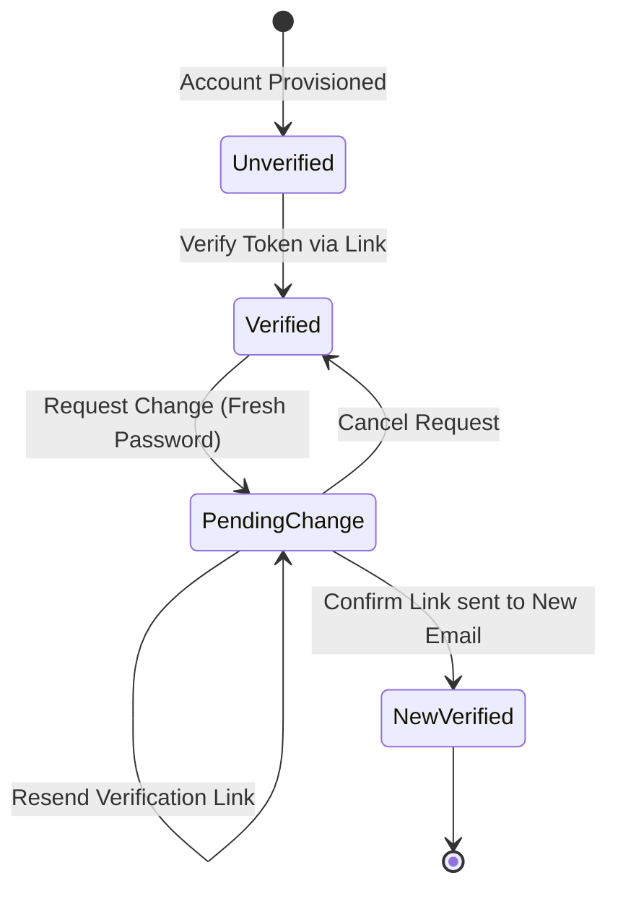

# Maevelle Business Management System
## My Account & Self-Service Architecture Specification

---

## 1. Architectural Overview & Domain Separation

The Maevelle Business Management System establishes a strict separation between **User Account / Identity** and **Organization / Team Membership**.

```text
┌─────────────────────────────────────────────────────────────┐
│                    USER IDENTITY (iam.users)                 │
│                                                             │
│  • id (UUID, immutable identity key)                        │
│  • name (canonical personal display name)                   │
│  • email (canonical login identifier)                       │
│  • emailVerified (boolean)                                  │
│  • image (avatar URL: /media/avatars/{userId}-{ts}.webp)    │
│  • createdAt, updatedAt                                     │
└──────────────┬───────────────────────────────┬──────────────┘
               │                               │
               ▼                               ▼
┌───────────────────────────────┐ ┌───────────────────────────┐
│     AUTHENTICATION & ACCESS   │ │  ORGANIZATION MEMBERSHIP  │
│                               │ │   (platform.memberships)  │
│ • iam.accounts (hashed pw)    │ │                           │
│ • iam.sessions (active logins)│ │ • organizationId          │
│ • iam.two_factor (TOTP/backup)│ │ • role (e.g. ADMIN)       │
│ • iam.verifications (tokens)  │ │ • permissions (JSONB)     │
│ • Self-Service: My Account    │ │ • status (ACTIVE/DISABLED)│
│   (/account, /api/admin/...)  │ │ • Admin: Team & Access    │
└───────────────────────────────┘ └───────────────────────────┘
```

### 1.1 Field Ownership Rules

| Field / Capability | Canonical Storage | Ownership / Mutability Boundary | Modification Surface |
| :--- | :--- | :--- | :--- |
| **Display Name** | `iam.users.name` | **User-owned**: Personal identity | `PATCH /admin/account/profile` |
| **Avatar / Photo** | `iam.users.image` | **User-owned**: Personal identity | `POST / DELETE /admin/account/avatar` |
| **Login Email** | `iam.users.email` | **User-owned**: Sensitive identity (requires verification) | `POST /admin/account/email/request-change` |
| **Password** | `iam.accounts.password` | **User-owned**: Private credential | `POST /admin/account/password` |
| **Two-Factor Auth** | `iam.two_factor` | **User-owned configuration** (subject to org policy) | `/account/security`, `POST /admin/security/two-factor/*` |
| **Active Sessions** | `iam.sessions` | **User-owned**: Login devices | `DELETE /admin/account/sessions/*` |
| **Role & Permissions** | `platform.memberships` | **Organization-controlled**: Administrative access | `Team & Access` (`/team`) |
| **Membership Status** | `platform.memberships` | **Organization-controlled**: Active / Suspended | `Team & Access` (`/team`) |

### 1.2 Access Authority & IDOR Prevention
1. **Self-Service Authorization**: Self-service endpoints are protected by `requireUserSession()`. They derive user identity strictly from the cryptographically verified session (`session.user.id`).
2. **Zero `userId` Parameters**: No self-service endpoint accepts a client-provided `userId`. This completely eliminates Insecure Direct Object Reference (IDOR) attacks across accounts.
3. **Decoupled from Administrative Permissions**: Self-service endpoints do not require administrative capabilities such as `team.members.read` or `team.members.manage`. Any authenticated user can manage their personal profile, email, password, and sessions.
4. **Mass-Assignment Defense**: All profile update endpoints validate request bodies through strict TypeBox schemas. Unlisted fields (such as `role`, `permissions`, `emailVerified`, `status`) are rejected or ignored.

---

## 2. Profile Avatar Pipeline & Lifecycle

Avatar uploads use Maevelle's local/object storage engine via `@maevelle/media` without creating dependencies on product catalog media structures.

```text
Client Upload (JPEG/PNG/WebP, max 2MB)
  │
  ▼
API Boundary Validation
  ├─ Content length check (≤ 2MB)
  ├─ Magic signature validation (validateMediaSignature)
  └─ Format check (JPEG, PNG, WebP only; SVG disallowed)
  │
  ▼
Image Processing (processAvatarImage via sharp)
  ├─ Normalization to 512×512 square rendition
  ├─ WebP re-encoding (privacy strip: EXIF/location metadata removed)
  └─ SHA-256 checksum computation
  │
  ▼
Object Storage (LocalObjectStorage / S3)
  ├─ Key: avatars/{userId}-{timestamp}.webp
  └─ Regex locator enforcement: /^avatars\/[a-zA-Z0-9_.-]+$/
  │
  ▼
Database & Old Asset Cleanup
  ├─ Update iam.users.image = /media/avatars/{filename}
  ├─ If previous avatar existed at /media/avatars/*, delete orphaned file
  └─ Append iam.audit_events (ACCOUNT_AVATAR_UPDATED)
```

Avatars are served publicly through `GET /media/avatars/:filename`, which validates the filename regex and streams the WebP content with caching headers (`public, max-age=86400`).

---

## 3. Email Lifecycle & Verification Mechanics



### 3.1 Initial Email Verification
- When an account's email is unverified, `POST /admin/account/email/resend-verification` creates a secure token in `iam.verifications`.
- Identifier: `verify-email:{userId}:{email}`.
- Value: Cryptographically secure 32-byte hex token.
- Expiration: 24 hours.
- Outbox event: `account.email.verification_requested`.
- Verification completion: `POST /admin/account/email/verify` with `{ token }` sets `iam.users.email_verified = true` and cleans up the verification record.

### 3.2 Secure Email Change
Changing a verified sign-in email is security-sensitive:
1. **Fresh Authentication**: `POST /admin/account/email/request-change` requires `currentPassword`. The server verifies the password against `iam.accounts.password` via `better-auth/crypto.verifyPassword()`.
2. **Duplicate Detection**: The server checks `iam.users` to confirm the new address is not already registered.
3. **Pending State**: The server stores an email change request in `iam.verifications`:
   - Identifier: `email-change:{userId}`.
   - Value: JSON `{ newEmail, code }`.
   - Expiration: 24 hours.
4. **Outbox & Notifications**:
   - `account.email.change_requested` emitted.
   - Security alert sent to the **current (old)** email alerting them of the request.
   - Verification link sent to the **new** email containing the verification token.
5. **Confirmation**:
   - When the user verifies via `POST /admin/account/email/confirm-change` with `{ token }`, the server atomically:
     - Updates `iam.users.email` to `newEmail`.
     - Sets `iam.users.email_verified = true`.
     - Deletes the pending verification record.
     - Appends audit event `ACCOUNT_EMAIL_CHANGED`.
     - Emits outbox event `account.email.changed`.
     - Revokes other active sessions to prevent session hijacking.

---

## 4. Password Management & Session Revocation

```text
Client Submission
  ├─ currentPassword
  ├─ newPassword (≥ 12 chars)
  └─ revokeOtherSessions (default: true)
  │
  ▼
Verification
  ├─ Check current password with verifyPassword(hash, currentPassword)
  └─ Enforce password policy: min 12 chars, not identical to current
  │
  ▼
Hash & Update
  ├─ Compute hashPassword(newPassword) via Better Auth crypto
  ├─ Update iam.accounts.password
  └─ Audit event: ACCOUNT_PASSWORD_CHANGED (no hashes/passwords in audit!)
  │
  ▼
Session Invalidation
  ├─ If revokeOtherSessions: delete all iam.sessions where userId = current and id != currentSessionId
  └─ Save session index in secondary storage
```

---

## 5. Active Session Management

### 5.1 Device Metadata Derivation
The server inspects the session's `userAgent` string and derives:
- `browser`: Chrome, Firefox, Safari, Edge, or Unknown
- `os`: Windows, macOS, Linux, iOS, Android
- `deviceCategory`: desktop vs. mobile
- `label`: Friendly representation (e.g., `Chrome on Windows`, `Safari on iPhone`)

### 5.2 Revocation Endpoints
1. `GET /admin/account/sessions`: Lists all active sessions for the authenticated user with friendly labels, IP addresses, creation timestamps, and an `isCurrentSession` boolean flag. Raw session tokens are never exposed.
2. `DELETE /admin/account/sessions/:id`: Revokes a specific other session belonging to the user. Validates ownership before deletion; cannot revoke the current session via this route.
3. `DELETE /admin/account/sessions/other`: Atomically revokes all sessions belonging to the user except the current session.
4. `DELETE /admin/account/sessions/all`: Revokes all sessions belonging to the user including the current session, terminating all devices and forcing re-login.

---

## 6. Audit & Outbox Integration

All account-level mutations append structured audit records to `iam.audit_events` and outbox events to `platform.outbox_events`.

| Action | Audit Event Code | Outbox Event Name | Sensitive Redaction |
| :--- | :--- | :--- | :--- |
| Update Display Name | `ACCOUNT_PROFILE_UPDATED` | `account.profile.updated` | None |
| Upload / Change Avatar | `ACCOUNT_AVATAR_UPDATED` | `account.avatar.updated` | None |
| Remove Avatar | `ACCOUNT_AVATAR_REMOVED` | `account.avatar.removed` | None |
| Resend Email Verification | `ACCOUNT_VERIFICATION_REQUESTED` | `account.email.verification_requested` | Token redacted |
| Complete Email Verification | `ACCOUNT_EMAIL_VERIFIED` | `account.email.verified` | None |
| Request Email Change | `ACCOUNT_EMAIL_CHANGE_REQUESTED` | `account.email.change_requested` | Password & tokens redacted |
| Confirm Email Change | `ACCOUNT_EMAIL_CHANGED` | `account.email.changed` | None |
| Cancel Email Change | `ACCOUNT_EMAIL_CHANGE_CANCELLED` | `account.email.change_cancelled` | None |
| Change Password | `ACCOUNT_PASSWORD_CHANGED` | `account.password.changed` | Passwords & hashes redacted |
| Revoke Session | `ACCOUNT_SESSION_REVOKED` | `account.session.revoked` | Session tokens redacted |
| Revoke Other Sessions | `ACCOUNT_OTHER_SESSIONS_REVOKED`| `account.sessions.revoked_all` | Session tokens redacted |
| Sign Out Everywhere | `ACCOUNT_ALL_SESSIONS_REVOKED` | `account.sessions.revoked_all` | Session tokens redacted |

> **Critical Safety Invariant**: Under no circumstances are raw passwords, password hashes, TOTP secrets, backup recovery codes, or raw session tokens stored in audit payloads, outbox events, or logged to application outputs.
