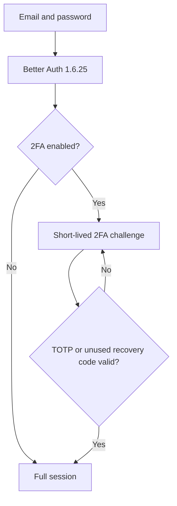
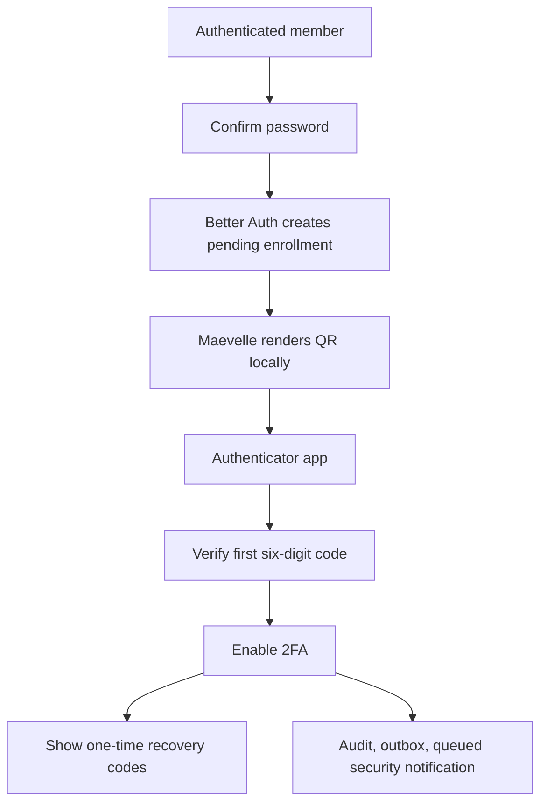
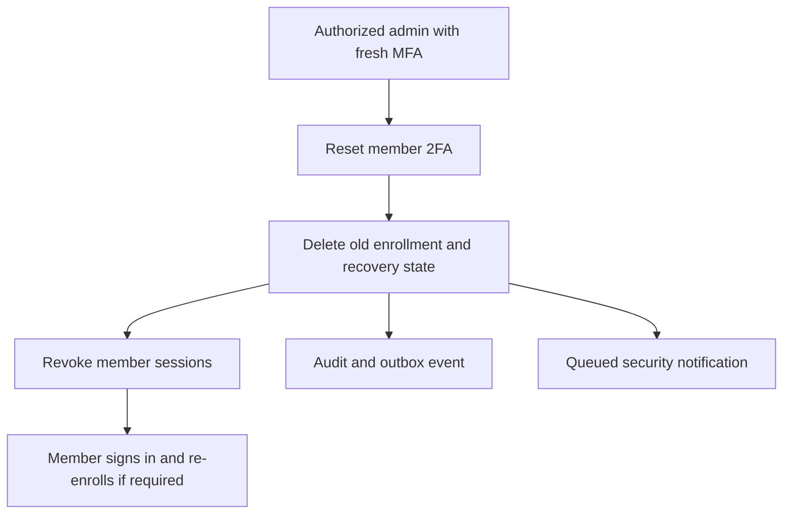

# Authenticator app two-factor authentication

**Status:** Implemented for internal Admin Portal identities  
**Authentication engine:** Better Auth 1.6.25 two-factor plugin  
**Scope:** Maevelle team members only; storefront customer authentication is unchanged

## What this protects

Two-factor authentication (2FA) adds a second proof to an administrator's password. A person who
knows only the password cannot enter a protected account. Maevelle implements the standard TOTP
protocol. Google Authenticator is one compatible app, but Maevelle does not call Google, require a
Google account, or use a Google API. Codes are generated on the phone and normally work without an
internet connection. Accurate automatic time on the phone and synchronized time on Maevelle's
servers are required.

TOTP has no per-message fee. Normal application hosting, email delivery, and operations costs still
apply.

## User guide

### Enable an authenticator

1. Sign in and open **Account security** from the Admin navigation.
2. Choose **Set up authenticator** and confirm the account password.
3. Scan the locally rendered QR code with a compatible authenticator app. If scanning is unavailable,
   enter the displayed setup key manually.
4. Enter the current six-digit code. Maevelle does not enable 2FA until this first code succeeds.
5. Save the recovery codes somewhere secure and separate from the phone. They are shown only at
   creation or regeneration time.

The QR, setup key, TOTP secret, and recovery codes are credentials. Do not screenshot or share them,
and do not paste them into support messages.

### Sign in afterward

Enter email and password first. Maevelle then shows an authenticator challenge. Enter the current
six-digit code, or choose **Use a recovery code instead**. A password-only challenge never receives a
normal Admin session.

### Recovery codes

Each recovery code can be used once. A consumed code cannot be reused, including by concurrent
requests. Regenerating recovery codes immediately invalidates every previous code. Regeneration
requires the password, a current authenticator code, and a recently established 2FA session.

### Lost phone

Use one saved recovery code. If both the authenticator and recovery codes are unavailable, contact an
administrator who has the dedicated 2FA reset capability. A reset never reveals the old QR or secret:
it deletes the enrollment, invalidates old authenticator and recovery codes, and revokes active
sessions. Where organization policy requires 2FA, the member must enroll again before protected work.

The Owner account cannot be reset by another member through this workflow. Owner recovery requires
controlled operational intervention and proof of authority; it is deliberately not a routine Team &
Access action.

### Disable 2FA

A member may disable their own authenticator only when organization policy does not require it.
Password confirmation, the current authenticator code, and a fresh 2FA session are required. All
sessions are revoked after disabling, so the user must sign in again.

## Authentication and enrollment architecture

## Security model and decisions

- Better Auth owns TOTP generation/verification, pending challenge cookies, recovery-code consumption,
  failed-attempt counters, and temporary account lockout. Maevelle does not implement TOTP crypto.
- The issuer is configured explicitly; the default is `Maevelle`, never `Better Auth`.
- Trusted-device bypass is disabled. Every new protected sign-in requires a second factor.
- A challenge lasts 10 minutes by default. The plugin applies its endpoint rate limit and Maevelle's
  `/auth/*` rate limit also applies.
- Ten failed second-factor attempts lock the account for 15 minutes by default. Values are validated
  at startup.
- Better Auth encrypts the persisted TOTP secret and recovery-code payload using its configured secret.
  Maevelle session/challenge secondary-storage values are independently encrypted with AES-256-GCM
  using `AUTH_ENCRYPTION_KEY`; storage keys are HMAC-derived.
- QR data is created in the browser with the local `qrcode` package. It is never sent to a QR service,
  placed in a URL, or persisted as an image.
- Enrollment and recovery responses set `Cache-Control: no-store, private`. Codes and secrets are not
  written to audit, outbox, notifications, application logs, browser storage, or generic user DTOs.
- Authentication and authorization remain separate. After 2FA, active membership, tenant isolation,
  capabilities, and business invariants are still checked normally.

## Organization policy

The policy has three modes:

| Mode | Behavior |
| --- | --- |
| `OPTIONAL` | Members may choose whether to enroll. |
| `CRITICAL_CAPABILITIES` | Owner and members holding active `CRITICAL` or `RESTRICTED` capabilities must enroll. |
| `ALL_MEMBERS` | Every active Admin member must enroll. |

Changing from optional enforcement starts a configurable grace period. During grace, eligible members
can work and see their deadline. After the deadline, the API permits only Admin context, authenticator
status/enrollment, and logout/auth endpoints; all other `/admin/*` operations return
`TWO_FACTOR_ENROLLMENT_REQUIRED`. This server-side gate prevents URL bypass. The Admin shell sends the
member to Account security without creating a redirect loop.

Policy changes require `admin.security.two_factor_policy.manage`, a fresh 2FA session, the acting
member's current TOTP, optimistic version matching, a reason, audit/outbox records, and member
notifications. Reset requires `admin.team.two_factor.reset` plus the same fresh-MFA proof. Owner and
self-reset are denied.

## Session decisions

- Enable: Better Auth replaces the enrollment session when the first code succeeds; other existing
  sessions are not automatically revoked.
- Disable: all sessions are revoked.
- Administrative reset: all target sessions are revoked.
- Recovery-code use: the successful challenge creates the normal session; the code is consumed once.
- Policy change: current requests are evaluated against live policy. Once the deadline is reached,
  existing sessions cannot access protected Admin APIs until enrollment completes.
- Password-change session behavior remains owned by the existing Better Auth password workflow.

## API surface

Maevelle wrappers are used for sensitive account and policy changes:

- `GET /admin/security/two-factor/status`
- `POST /admin/security/two-factor/enrollment`
- `POST /admin/security/two-factor/enrollment/verify`
- `POST /admin/security/two-factor/backup-codes`
- `POST /admin/security/two-factor/disable`
- `GET|PUT /admin/security/two-factor/policy`
- `POST /admin/team/:membershipId/two-factor/reset`

The login challenge uses Better Auth's `/auth/two-factor/verify-totp` and
`/auth/two-factor/verify-backup-code`. Maevelle forces `trustDevice: false`. Direct raw enable,
disable, and recovery-code-generation endpoints are blocked so callers cannot bypass Maevelle policy,
reauthentication, audit, or authorization.

## Data ownership

The mutable development baseline migration `0004_iam_and_authentication` contains Better Auth's
canonical `iam.users.two_factor_enabled` field and the unique-per-user `iam.auth_two_factor` record
(`secret`, encrypted recovery-code payload, verification state, failed count, and lock expiry). The
record cascades on user deletion. Maevelle separately owns
`iam.organization_two_factor_policies`; policy data is tenant-scoped, versioned, constrained, and does
not duplicate authenticator credentials.

Security lifecycle events use the existing `audit.audit_events`, `platform.outbox_events`, and
`notifications.notifications` infrastructure. Critical security notifications create IN_APP and EMAIL
deliveries regardless of ordinary preference settings; provider delivery remains asynchronous. Failure
to deliver a notification does not reverse an already completed authentication action.

## Troubleshooting

- **Every code is invalid:** enable automatic date/time and timezone on the phone, select the correct
  Maevelle entry, wait for a new code, and confirm server/container NTP synchronization.
- **Temporarily locked:** stop trying codes and wait for the configured lock interval. Repeated attempts
  do not shorten it. Review the account's security/audit activity if the failures were unexpected.
- **No phone:** use one unused recovery code. Otherwise request an authorized administrative reset.
- **Old QR unavailable:** this is intentional. Re-exposing an enrollment secret would let another
  person clone the authenticator.
- **Member is stuck after policy change:** verify the active organization, policy deadline, account
  status, and the member's capability-derived requirement, then complete enrollment at Account security.

